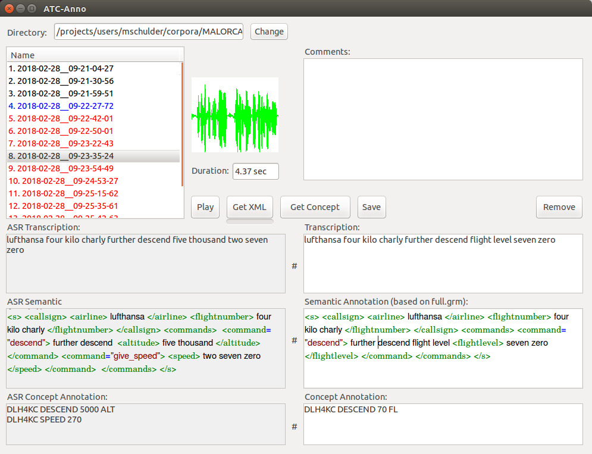

[](https://doi.org/10.5281/zenodo.3698318)

# ATC-Anno

ATC-Anno is an annotation tool for the transcription and semantic annotation of air traffic control utterances.
Its most unusual feature is its prediction of semantic annotations based on a finite-state grammar. As long as a transcribed sentence is moderately close to a sentence in the grammar, the annotation found in the grammar can be applied to the transcription.




## Tutorial
To demonstrate the workflow and features of the tool, we have created a brief video tutorial.
The video has optional subtitles.

- Repository location: `media/tutorial.mp4`
- [Download the tutorial](media/tutorial.mp4?raw=true)
- [Watch on Youtube](https://youtu.be/4me6htnJIBk)


## Requirements
ATC-Anno is written in Python 2.7 and requires the following additional packages:
- [wxPython](https://www.wxpython.org/)
- [pyaudio](https://people.csail.mit.edu/hubert/pyaudio/)

### Finite-state Grammar
To access the **_Get XML_** feature, you need to provide a finite-state grammar that uses the [OpenFST](http://www.openfst.org/) format.
The default location for the grammar is `data/grammars/default.fst`

### Concept Extraction
The conversion of airline names to callsign representations (e.g. "Lufthansa" to "DLH") is based on the airline dictionary found at `data/airlines/callsigns.txt`. You can expand the file to include all airlines that occur in your grammar.


## Attribution
This software is published under an [MIT License](LICENSE).

If you use it in your research or work, please cite the following publication:

[Schulder, Marc](http://marc.schulder.info) and O'Mahony, Johannah and Bakanouski, Yury and [Klakow, Dietrich](https://www.lsv.uni-saarland.de/people/dietrich-klakow/) (2020). **"ATC-Anno: Semantic Annotation for Air Traffic Control with Assistive Auto-Annotation"**. _Proceedings of the 12th Conference on Language Resources and Evaluation (LREC)_, Marseille, France, 11–16 May 2020.


### BibTex
```
@InProceedings{schulder2020atcAnno,
  author = {Schulder, Marc and O'Mahony, Johannah and Bakanouski, Yury and Klakow, Dietrich},
  title = {ATC-Anno: Semantic Annotation for Air Traffic Control with Assistive Auto-Annotation},
  booktitle = {Proceedings of the Twelfth International Conference on Language Resources and Evaluation (LREC 2018)},
  year = {2020},
  address = {Marseille, France},
  publisher = {European Language Resources Association (ELRA)},
}
```
